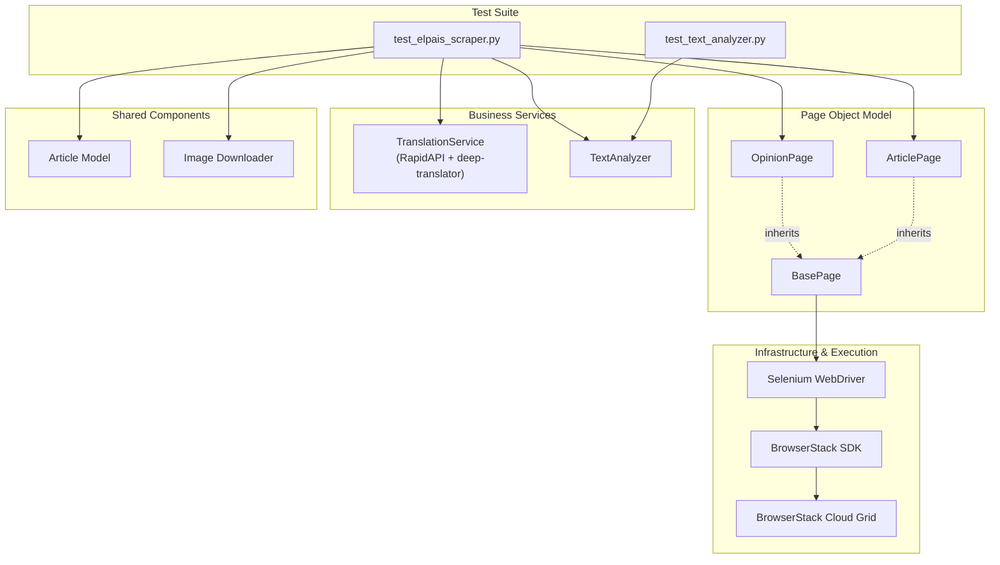
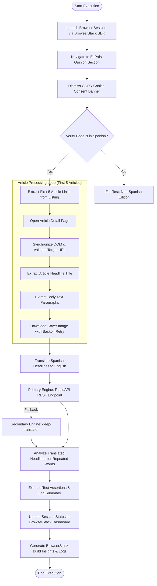
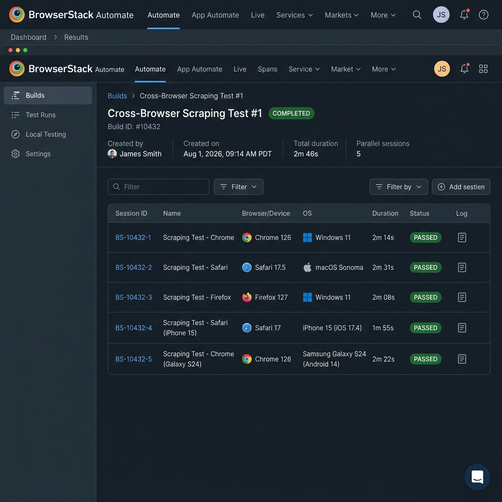

# El País Opinion Scraper & BrowserStack Cross-Browser Test Suite

[](https://www.python.org/)
[](https://www.selenium.dev/)
[](https://docs.pytest.org/)
[](https://www.browserstack.com/)
[](https://rapidapi.com/)

A production-grade cross-browser automation and web scraping framework built with **Selenium WebDriver**, **pytest**, and the **Page Object Model (POM)** pattern. The suite automatically scrapes opinion articles from the Spanish news outlet *El País*, downloads cover images, translates Spanish headlines to English via **RapidAPI** (with automatic zero-config fallback), computes word frequency metrics, and executes concurrently across 5 desktop and mobile browser configurations using the **BrowserStack SDK**.

---

## Key Features

- **Automated Scraper**: Navigates the *El País* Opinion section, validates Spanish language loading via multi-indicator checks, and extracts the first 5 articles (title, content, cover image).
- **Page Object Model (POM)**: Encapsulates page logic with explicit waits, stale element recovery, and multi-tier CSS fallback chains for dynamic DOM elements.
- **Dual Translation Engine**: Translates Spanish headlines to English using the Rapid Translate Multi Traduction API (RapidAPI) with an automatic fallback to `deep-translator`.
- **Text & Frequency Analysis**: Tokenizes translated titles, filters English stopwords, and identifies repeated words occurring more than twice.
- **Parallel Cloud Execution**: Executes concurrently across 5 desktop and mobile browser environments on BrowserStack Automate without boilerplate test modifications.

---

## Architecture

### 1. High-Level System Architecture



The system follows a layered architecture separating test orchestration, page interactions, business services, infrastructure, and shared components. Page Object Model classes encapsulate DOM interactions and explicit waits, while business services operate independently of the browser automation layer. The BrowserStack SDK intercepts WebDriver instantiation to manage session allocation and capability dispatch dynamically.

---

### 2. End-to-End Execution Flow



The execution lifecycle enforces strict synchronization barriers before reading article elements. Image downloads run with exponential backoff retries, while translation and word frequency evaluation precede final test assertions. Session statuses and metadata are dispatched to the BrowserStack Automate dashboard via JSON-serialized executor commands.

---

## Translation API

The framework implements a resilient, dual-engine translation architecture in `TranslationService`:

- **Primary Provider**: **Rapid Translate Multi Traduction API (RapidAPI)**
  - REST endpoint: `https://rapid-translate-multi-traduction.p.rapidapi.com/t`
  - Activated when `RAPIDAPI_KEY` is present in `.env`.
- **Automatic Fallback Provider**: **`deep-translator` (Google Translate Engine)**
  - Activated automatically if `RAPIDAPI_KEY` is omitted, unconfigured, or encounters API rate limits / network timeouts.

### Engineering Rationale
This fallback architecture ensures production reliability. It guarantees that local runs, CI pipelines, and reviewer evaluations execute seamlessly out-of-the-box without hard dependency on third-party API credentials, while fully supporting authenticated REST API integration when credentials are provided.

---

## Repository Structure

```
browserstack-assgn/
├── .github/workflows/ci.yml   # GitHub Actions CI pipeline
├── docs/images/               # Dashboard screenshots & documentation assets
│   ├── browserstack-dashboard.png  # BrowserStack Automate execution summary
│   └── browserstack-build.png      # BrowserStack Build Insights report
├── downloads/                 # Scraped cover images directory
├── pages/                     # Page Object Model abstractions
│   ├── base_page.py           # Explicit waits, scrolling, & cookie handler
│   ├── opinion_page.py        # Opinion section listing & language check
│   └── article_page.py        # Article detail page extraction
├── services/                  # Business logic services
│   ├── translator.py          # RapidAPI client with fallback engine
│   └── text_analyzer.py       # Tokenization & stopword frequency analyzer
├── tests/                     # Test suite
│   ├── test_elpais_scraper.py # End-to-end cross-browser test
│   └── test_text_analyzer.py  # Unit tests for text analyzer
├── browserstack.yml           # BrowserStack SDK 5-platform matrix config
├── conftest.py                # Pytest driver fixture with mobile detection
├── models.py                  # Article dataclass model
├── pytest.ini                 # Pytest logging & CLI settings
├── requirements.txt           # Python dependencies
├── utils.py                   # Image downloader with retry backoff
└── README.md                  # Project documentation
```

---

## Setup & Environment Configuration

### Prerequisites
- Python 3.10+
- BrowserStack Automate account (Username & Access Key)

### Installation
```bash
git clone https://github.com/TechySan031/browserstack-elpais-opinion-scraper.git
cd browserstack-elpais-opinion-scraper

# Create and activate virtual environment
python -m venv .venv
source .venv/bin/activate  # On Windows: .venv\Scripts\activate

# Install dependencies and BrowserStack SDK
pip install -r requirements.txt
pip install browserstack-sdk
```

### Environment Configuration
Copy `.env.example` to `.env` and set your credentials:
```env
BROWSERSTACK_USERNAME=your_username
BROWSERSTACK_ACCESS_KEY=your_key
RAPIDAPI_KEY=optional_rapidapi_key  # Falls back to deep-translator if omitted
HEADLESS=false                      # Set true for headless local runs
```

---

## Execution

### Local Execution
Run unit tests:
```bash
pytest tests/test_text_analyzer.py -v
```

Run E2E test locally using Chrome:
```bash
pytest tests/test_elpais_scraper.py -v -s
```

### BrowserStack Parallel Cloud Execution
Execute the test suite concurrently across 5 browser platforms using the BrowserStack SDK:
```bash
browserstack-sdk pytest tests/test_elpais_scraper.py -v -s
```

---

## BrowserStack Integration & Validation

Cross-browser execution is managed via `browserstack.yml`, which defines a 5-platform matrix across desktop and mobile devices:


*BrowserStack Automate dashboard showing concurrent execution across 5 desktop and mobile browser sessions.*

| Platform | OS / Device | Browser Engine | Execution Status |
|---|---|---|---|
| **Desktop 1** | Windows 11 | Firefox 153.0 | ✅ Passed (4m 07s) |
| **Desktop 2** | Windows 11 | Chrome 150.0 | ✅ Passed (2m 46s) |
| **Desktop 3** | macOS Sonoma | Safari 17.3 | ✅ Passed (5m 50s) |
| **Mobile 1** | iPhone 15 (iOS 17.3) | Safari Mobile | ✅ Passed (1m 58s) |
| **Mobile 2** | Samsung Galaxy S24 (Android 14.0) | Chrome Mobile | ✅ Passed (6m 15s) |

Build stability and performance metrics are tracked on the BrowserStack Insights dashboard:


*BrowserStack Build Insights report verifying 100% test stability and zero failures.*

---

## Key Design Decisions

- **Zero-Code-Change SDK Integration**: Used `browserstack.yml` to define platform matrices natively, removing hardcoded `RemoteWebDriver` capabilities from test code.
- **Strict DOM Synchronization**: `ArticlePage.navigate()` waits for `document.readyState == 'complete'`, target URL path matching, and headline visibility before extraction.
- **Resilient Multi-Selector Fallbacks**: Primary CSS locators are backed by semantic HTML fallback chains (`h1.a_t` -> `h1`, `.a_c p` -> `article p`) to handle layout variations across editorial categories.
- **JSON-Serialized Executor Commands**: BrowserStack session metadata commands are serialized via `json.dumps()` to prevent syntax errors during status reporting.

---

## Limitations & Trade-offs

- **Anti-Bot Protection on Cloud Exit IPs**: *El País* occasionally presents rate-limit or anti-bot verification screens on public cloud IPs. The framework mitigates this via automated page detection and single-retry navigation before throwing a descriptive exception.
- **Paywalled Content Gating**: Certain opinion articles restrict body text for non-subscribers; extraction safely captures available public paragraphs.
- **Optional Translation API Key**: RapidAPI requires an active subscription key; the included `deep-translator` fallback guarantees uninterrupted execution if an API key is not supplied.
- **Dynamic DOM Changes**: Selectors use multi-tier fallback chains, but future website redesigns by *El País* may require updating CSS locators.

---

## Tech Stack

- **Language**: Python 3.10+
- **Automation**: Selenium WebDriver 4.20+
- **Test Runner**: pytest 8.0+
- **Cloud Grid**: BrowserStack Automate (BrowserStack SDK)
- **Translation Services**: RapidAPI / deep-translator
- **CI/CD**: GitHub Actions
