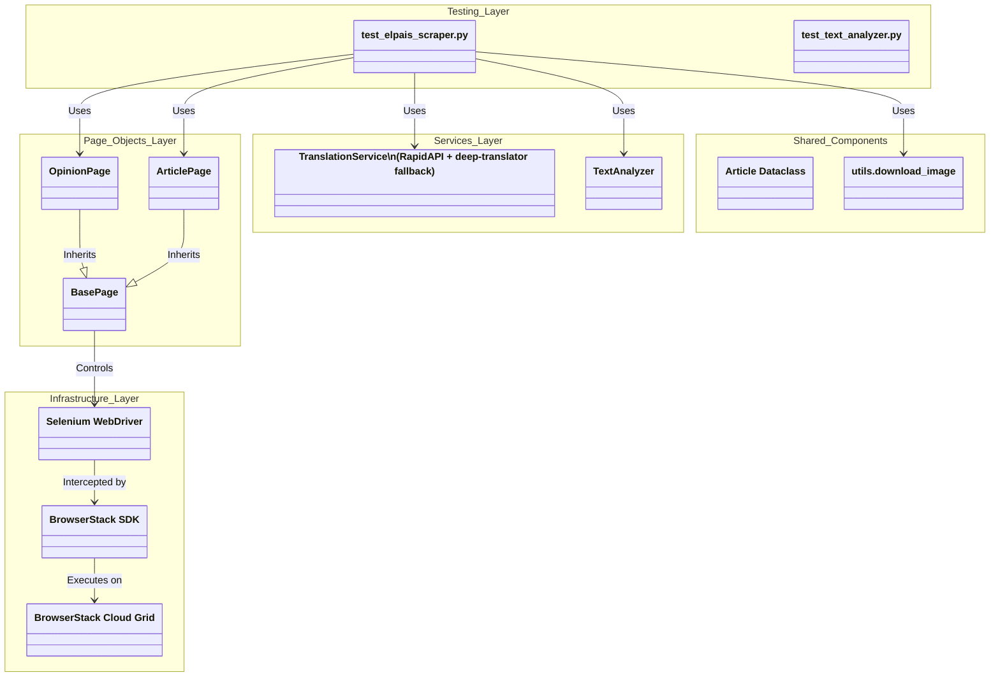
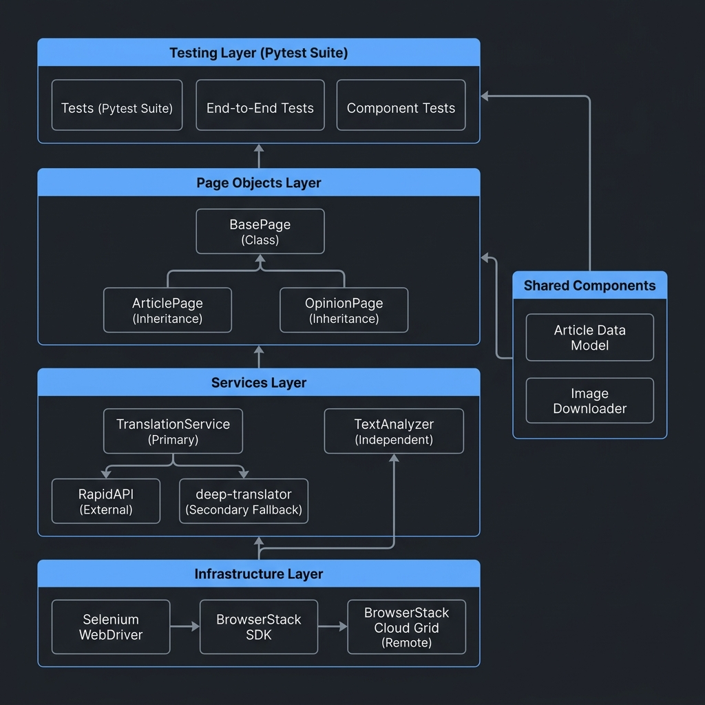

# El País Opinion Scraper & BrowserStack Cross-Browser Test Suite

[](https://www.python.org/)
[](https://www.selenium.dev/)
[](https://docs.pytest.org/)
[](https://www.browserstack.com/)

Automated Selenium test suite that scrapes opinion articles from Spanish news outlet *El País*, downloads cover images, translates headlines to English, analyzes word frequencies, and runs in parallel across 5 desktop and mobile browser configurations on BrowserStack.

---

## Features

- **Automated Web Scraping**: Navigates the *El País* Opinion section, verifies Spanish language loading, and extracts the first 5 articles (title, body paragraphs, cover image).
- **Resilient Page Object Model**: Encapsulates page logic with explicit waits, stale element recovery, and multi-selector fallbacks for dynamic DOM elements.
- **Dual Translation Engine**: Translates Spanish headlines to English via RapidAPI (Rapid Translate API) with zero-config fallback to `deep-translator`.
- **Frequency Analysis**: Normalizes text, filters common English stopwords, and calculates word frequencies occurring more than twice across translated titles.
- **Parallel Cloud Execution**: Runs concurrently across 5 desktop and mobile browser environments using the BrowserStack Python SDK.

---

## Architecture

The framework is structured into distinct layers separating test orchestration, page interactions, business services, infrastructure, and shared components.





*The framework follows a layered architecture based on the Page Object Model (POM), separating test orchestration, page interactions, business services, infrastructure, and shared components.*

---

## Repository Structure

```
browserstack-assgn/
├── .github/workflows/ci.yml   # GitHub Actions CI (linting & unit tests)
├── docs/images/               # Documentation screenshots and assets
├── downloads/                 # Directory for scraped cover images
├── pages/                     # Page Object Model abstractions
│   ├── base_page.py           # Explicit waits, scrolling, cookie handler
│   ├── opinion_page.py        # Opinion section listing & language check
│   └── article_page.py        # Synchronized article detail page extraction
├── services/                  # Independent business services
│   ├── translator.py          # RapidAPI client with fallback translator
│   └── text_analyzer.py       # Regex tokenization & stopword filtering
├── tests/                     # Test suite
│   ├── test_elpais_scraper.py # E2E cross-browser scraping test
│   └── test_text_analyzer.py  # Unit tests for text analyzer
├── browserstack.yml           # BrowserStack SDK 5-platform matrix
├── conftest.py                # Pytest driver fixture
├── models.py                  # Article dataclass model
├── pytest.ini                 # Pytest CLI configuration & logging settings
├── requirements.txt           # Python dependencies
├── utils.py                   # Image downloader with retries & backoff
└── README.md                  # Project documentation
```

---

## Setup

### Prerequisites
- Python 3.10+
- BrowserStack account (Username and Access Key)

### Installation
```bash
git clone https://github.com/TechySan031/browserstack-elpais-opinion-scraper.git
cd browserstack-elpais-opinion-scraper

# Create and activate virtual environment
python -m venv .venv
source .venv/bin/activate  # On Windows: .venv\Scripts\activate

# Install dependencies
pip install -r requirements.txt
pip install browserstack-sdk
```

### Environment Configuration
Copy `.env.example` to `.env` and set your BrowserStack credentials:
```env
BROWSERSTACK_USERNAME=your_username
BROWSERSTACK_ACCESS_KEY=your_key
RAPIDAPI_KEY=optional_rapidapi_key  # Falls back to deep-translator if omitted
HEADLESS=false                      # Set true for headless local runs
```

---

## Local Execution

Run unit tests:
```bash
pytest tests/test_text_analyzer.py -v
```

Run E2E test locally using Chrome:
```bash
pytest tests/test_elpais_scraper.py -v -s
```

---

## BrowserStack Execution

Execute across 5 parallel platforms via BrowserStack SDK:
```bash
browserstack-sdk pytest tests/test_elpais_scraper.py -v -s
```

---

## BrowserStack Validation

Tests executed concurrently across 5 desktop and mobile browser environments on BrowserStack Automate:


| Platform | OS / Device | Browser Engine | Status |
|---|---|---|---|
| **Desktop 1** | Windows 11 | Chrome (Latest) | ✅ Passed |
| **Desktop 2** | macOS Sonoma | Safari (Latest) | ✅ Passed |
| **Desktop 3** | Windows 11 | Firefox (Latest) | ✅ Passed |
| **Mobile 1** | iPhone 15 (iOS 17) | Safari Mobile | ✅ Passed |
| **Mobile 2** | Samsung Galaxy S24 (Android 14) | Chrome Mobile | ✅ Passed |

Full session recordings, network logs, console logs, and performance metrics for each session are available on the [BrowserStack Automate Dashboard](docs/images/browserstack-dashboard.png).


---

## Design Decisions

- **Zero-Code-Change SDK Parallelization**: Utilized `browserstack.yml` to define platform matrices natively, eliminating boilerplate `webdriver.Remote` capabilities from test code.
- **Strict DOM Synchronization**: `ArticlePage.navigate()` waits for `document.readyState == 'complete'`, target URL path matching, and headline visibility before extraction, preventing stale element state across navigations.
- **Resilient Multi-Selector Fallbacks**: Primary CSS classes are backed by semantic HTML tag fallbacks (`h1.a_t` -> `h1`, `.a_c p` -> `article p`) to handle layout variations across editorial categories.
- **Defensive API Design**: `TranslationService` attempts RapidAPI with retries before using `deep-translator`, ensuring tests execute reliably even without an API key.

---

## Results

```text
==================================== SUMMARY ====================================
Articles scraped:    5
Articles translated: 5
Images downloaded:   5 (article_1.jpg to article_5.jpg)
Repeated words (>2): 0 (or list of words if threshold met)
=================================================================================
PASSED
```

---

## Future Improvements

- Add `mypy` static type checking to CI pipeline.
- Implement HTML report generation with embedded screenshots for failed assertions.
- Extend mobile gesture support for infinite-scroll article feeds.

---

## Tech Stack

- **Language**: Python 3.10+
- **Automation**: Selenium WebDriver 4.20+
- **Test Framework**: pytest 8.0+
- **Cloud Grid**: BrowserStack Automate (BrowserStack SDK)
- **Translation**: RapidAPI / deep-translator
- **CI/CD**: GitHub Actions
