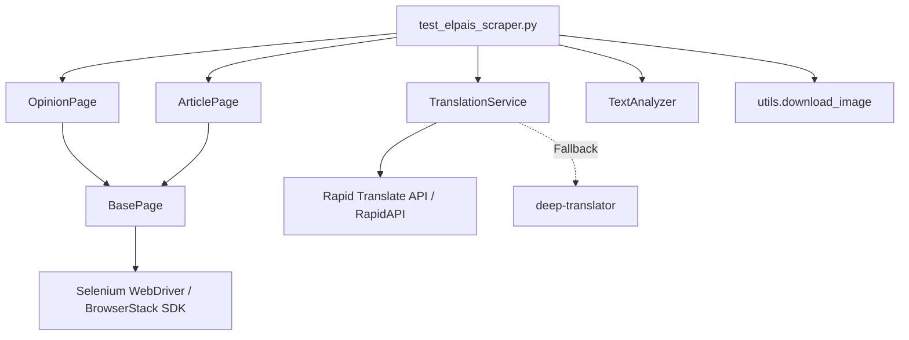

# El País Opinion Section Scraper & Cross-Browser Test Suite

[](https://github.com/browserstack/elpais-scraper-demo/actions/workflows/ci.yml)
[](https://www.python.org/downloads/)
[](https://www.selenium.dev/)
[](https://www.browserstack.com/)

A production-grade Python & Selenium automation framework built as part of the **BrowserStack Customer Engineering** implementation review.

This solution navigates the Spanish news portal **El País**, scrapes articles from the **Opinión** section, downloads cover images, translates headlines from Spanish to English using a resilient dual-engine translation service, and performs word frequency analysis across all translated headers. The test executes across **5 parallel threads** spanning desktop and mobile browsers on the **BrowserStack Automate** cloud grid.

---

## 📐 Architecture & Key Design Decisions

The framework follows clean architecture, SOLID principles, and the **Page Object Model (POM)** design pattern to ensure high maintainability, readability, and reliability.



### Technical Highlights
- **Page Object Model (POM)**: Isolates DOM locators and page interactions from test assertion logic (`OpinionPage`, `ArticlePage`, `BasePage`).
- **Resilient Locators & Fallbacks**: Primary CSS selectors target exact semantic elements, backed by fallbacks to prevent test flakiness if website markup updates.
- **Dual-Engine Translation**:
  - **Primary**: Rapid Translate Multi Traduction API (RapidAPI) — a robust, structured REST API.
  - **Zero-Config Fallback**: `deep-translator` (Google Translate wrapper) activates automatically if no API key is provided or if network limits occur.
- **BrowserStack SDK Integration**: Zero-code-change cloud parallelization handled natively by `browserstack.yml`. Sessions report real-time status and names (`setSessionName`, `setSessionStatus`) to the Automate dashboard.
- **Robust Exception & Cookie Handling**: Handles GDPR cookie banners across viewports, gracefully logs paywalled articles, and streams cover image downloads without test interruption.

---

## 📁 Repository Structure

```
browserstack-assgn/
├── .github/
│   └── workflows/
│       └── ci.yml                  # GitHub Actions CI workflow (linting + unit tests)
├── downloads/
│   └── .gitkeep                    # Directory for downloaded article cover images
├── pages/
│   ├── __init__.py
│   ├── base_page.py                # Core Selenium helper methods & cookie banner handling
│   ├── opinion_page.py             # Opinion landing page interaction & article link extraction
│   └── article_page.py             # Full article page title, content, & image extraction
├── services/
│   ├── __init__.py
│   ├── translator.py               # Dual-engine Spanish-to-English translation service
│   └── text_analyzer.py            # Word frequency analyzer with stopword filtering
├── tests/
│   ├── __init__.py
│   ├── test_elpais_scraper.py      # E2E cross-browser scraping & analysis test
│   └── test_text_analyzer.py       # Fast unit test suite for text analysis logic
├── .env.example                    # Environment variable configuration template
├── .gitignore                      # Git exclusion rules
├── browserstack.yml                # BrowserStack SDK 5-platform parallel matrix
├── conftest.py                     # Pytest driver fixture setup
├── models.py                       # Article dataclass model
├── pytest.ini                      # Pytest CLI configuration & logging settings
├── requirements.txt                # Project dependencies
├── utils.py                        # Resilient image downloader utility
└── README.md                       # Repository documentation
```

---

## ⚡ Quick Start

### 1. Prerequisites
- Python 3.10 or higher
- Chrome browser (for local testing; Selenium 4.20+ manages driver binaries automatically)
- A BrowserStack Account (Username & Access Key)

### 2. Installation
Clone the repository and install dependencies:

```bash
git clone https://github.com/your-username/browserstack-assgn.git
cd browserstack-assgn

# Create and activate virtual environment
python -m venv venv
source venv/bin/activate  # On Windows: venv\Scripts\activate

# Install requirements
pip install -r requirements.txt
pip install browserstack-sdk
```

### 3. Environment Configuration
Copy the example `.env` file and set your credentials:

```bash
cp .env.example .env
```

Edit `.env`:
```env
BROWSERSTACK_USERNAME=your_browserstack_username
BROWSERSTACK_ACCESS_KEY=your_browserstack_key
RAPIDAPI_KEY=your_optional_rapidapi_key  # Optional: falls back to deep-translator if omitted
HEADLESS=false                           # Set to true for headless local runs
```

---

## 🧪 Running the Tests

### Fast Unit Tests (No Selenium / API required)
```bash
pytest tests/test_text_analyzer.py -v
```

### Local Execution (Single Browser)
Run the E2E test locally using Chrome:
```bash
pytest tests/test_elpais_scraper.py -v -s
```
*To run headlessly locally, set `HEADLESS=true pytest tests/test_elpais_scraper.py -v -s`.*

---

## ☁️ Cross-Browser Execution on BrowserStack

The test suite is configured to execute across **5 parallel threads** covering major desktop and mobile browser engines.

### Platform Matrix (`browserstack.yml`)

| Platform | OS / Device | Browser Engine | Orientation | Rationale |
| :--- | :--- | :--- | :--- | :--- |
| **Desktop 1** | Windows 11 | Chrome (Latest) | N/A | Dominant Desktop Chromium Engine |
| **Desktop 2** | macOS Sonoma | Safari (Latest) | N/A | Apple WebKit Engine |
| **Desktop 3** | Windows 11 | Firefox (Latest) | N/A | Mozilla Gecko Engine |
| **Mobile 1** | iPhone 15 (iOS 17) | Safari Mobile | Portrait | iOS WebKit Mobile Standard |
| **Mobile 2** | Samsung Galaxy S24 (Android 14) | Chrome Mobile | Portrait | Android Mobile Standard |

### Executing on BrowserStack Grid
Prepend your pytest execution with `browserstack-sdk`:

```bash
browserstack-sdk pytest tests/test_elpais_scraper.py -v -s
```

### Verification & Dashboard
1. Log into your [BrowserStack Automate Dashboard](https://automate.browserstack.com/).
2. Locate the build **"Cross-Browser Scraping Test"**.
3. Observe **5 parallel sessions** executing simultaneously.
4. Verify session names ("El País Opinion Scraper") and pass/fail statuses updated dynamically via `browserstack_executor`.

---

## 📊 Sample Execution Output

```text
10:15:02 [INFO] ============================================================
10:15:02 [INFO] STEP 1: Navigate to El País Opinion section
10:15:02 [INFO] ============================================================
10:15:05 [INFO] Cookie consent accepted via: button[aria-label='Aceptar y cerrar']
10:15:05 [INFO] ✓ Page confirmed to be in Spanish
10:15:05 [INFO] ============================================================
10:15:05 [INFO] STEP 3: Fetch first 5 articles from Opinion section
10:15:05 [INFO] ============================================================
10:15:06 [INFO] Found 5 articles to process
...
10:15:20 [INFO] ============================================================
10:15:20 [INFO] STEP 5: Translate article titles to English
10:15:20 [INFO] ============================================================
10:15:21 [INFO] 🌐 ES: Desafío humanitario y diplomático
10:15:21 [INFO]    EN: Humanitarian and diplomatic challenge
...
10:15:22 [INFO] ============================================================
10:15:22 [INFO] STEP 6: Analyze word frequency in translated headers
10:15:22 [INFO] ============================================================
10:15:22 [INFO] Words repeated more than twice across all headers:
10:15:22 [INFO]   challenge            → 3 occurrences
10:15:22 [INFO] ============================================================
10:15:22 [INFO] ✅ SUMMARY
10:15:22 [INFO] ============================================================
10:15:22 [INFO] Articles scraped:    5
10:15:22 [INFO] Articles translated: 5
10:15:22 [INFO] Repeated words:      1
```

---

## 🛠️ GitHub Actions CI/CD Integration

The repository includes a GitHub Actions workflow (`.github/workflows/ci.yml`) that triggers on push and pull requests to validate code formatting and run unit tests automatically.

---

## 👤 Author & Support

Developed for the **BrowserStack Customer Engineering** implementation review.
For questions regarding this framework or live POC demonstrations, please contact the candidate.
